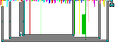

LLMs as Yak-shavers
===================

This image is actually a computer program. When run, it prints out the Mandelbrot Set to the terminal. For niceness, the program itself looks like the Mandelbrot Set.

If you did not know that computer programs could come in image form, I encourage you to check out [Piet](https://www.dangermouse.net/esoteric/piet.html) which will explain everything.

# The long road
This has long been a side-project of mine, that kept meandering into [Yak-shaving](https://joi.ito.com/weblog/2005/03/05/yak-shaving.html).

Piet is not a particularly easy language to work in; it is basically an assembly language where you are fiddling with values on a stack and you can't even rearrange your commands easily.

So obviously the thing to do was to write my own text-based language with the same commands as Piet, so I could write and debug the program in an easier environment.

And why not write in Rust while I was at it? I'd been meaning to learn Rust and this would be a good opportunity.

And honestly, that wasn't so hard. Interpreters are pretty easy to write and pretty soon I had my own Pietxt interpreter. [src/main.rs](./src/main.rs) and [src/lib.rs](src/lib.rs) are the results of that effort.

So now it was time to write my mandelbrot program.

But first, I should make sure I had the basic algorithm right by implementing it in a higher level language. Nothing too high; I needed to use strictly integer math instead of a Complex class that handled that for me, but still fairly high level. So I wrote [prototype.rb](./mandelbrot/prototype.rb) in Ruby, using only simple constructs like loops and integer math. This became my reference implementation, and was much easier to tweak settings on than Pietxt.

Ok, now I was finally ready to write some Pietxt!

I made some progress. And then this suffered the fate of most side projects, and sat idle for a year.

# LLM at the end of the tunnel

And then LLMs got good, and I picked a lot of those side projects back up.

I tried to get it to write Pietxt. It crashed out. So instead I used it to extend my interpreter in ways that were useful to me, which it was great at. I broke my Pietxt into components (even the two loops were a challenge in this language) and then wrote tests around them just like I would for a "real" program. When I needed a new debugging command, I just had Claude add it so I could focus on the central program instead of the tools needed to build that central program.

Pretty soon I had a [working Mandelbrot program](./snippets/full_program.txt) in Pietxt.

Now I needed to translate this into actual Piet. Boy, wouldn't it be nice to have a compiler turn my text into an image? It wouldn't have the final pretty shape I wanted, but getting all the necessary colors and block sizes would still be a great help.

Claude was able to write about 90% of the compiler with no problem. What it could not seem to handle were branches. I decided to just fill those in myself; my program only had 3 loops anyway.

But wait, what should I actually draw those with? Surely not MS Paint. https://www.bertnase.de/npiet/ provides both a Piet interpreter and a simple Piet IDE. The problem is that the IDE is written in TCL, which is suprisingly hard to find for Windows.

It turns out it's easier to just tell Claude to translate the program into Python, which [it did](./npietedit/npietedit.py) with little fuss. And from there, I was able to keep adding quality of life features as I drew my program, without taking my focus off the Piet itself.

What was surprising to me was how useful this extended pipeline ended up being. At one point, I ran into integer overflows in my program using npiet. Going back to my original ruby program let me tweak parameters until I found some that stayed within int16 and still looked decent, then I could update my piettxt and compile it into a new Piet rough draft. This AI-built pipeline was very useful!

It didn't take much additional work on my part to make this ugly version of the program.

It works, but it's not art. But from there, transcribing the straight line program into fractal form was a simple task in my new IDE.

# What the LLM can't do (yet?)

I found Opus 4.6 and below useless when it came to understanding or writing Piet and Pietxt. However, on a lark I did throw Opus 4.7 at a bug in one of my Piet programs (an infinite loop) and though it consumed multiple sessions' worth of my usage, it was successful in identifying the problem (I was re-entering my loop at the wrong instruction). So we may not be far off from when they are able to program even in esoteric languages like these.

# Artifacts

This repo will continue to stand as a series of artifacts dropped along the way to finally completing a pretty Piet program. Maybe they'll be useful to you, maybe not; I won't claim vibe coding is robust. But it can definitely work to clear obstacles and let you focus on the main thing.